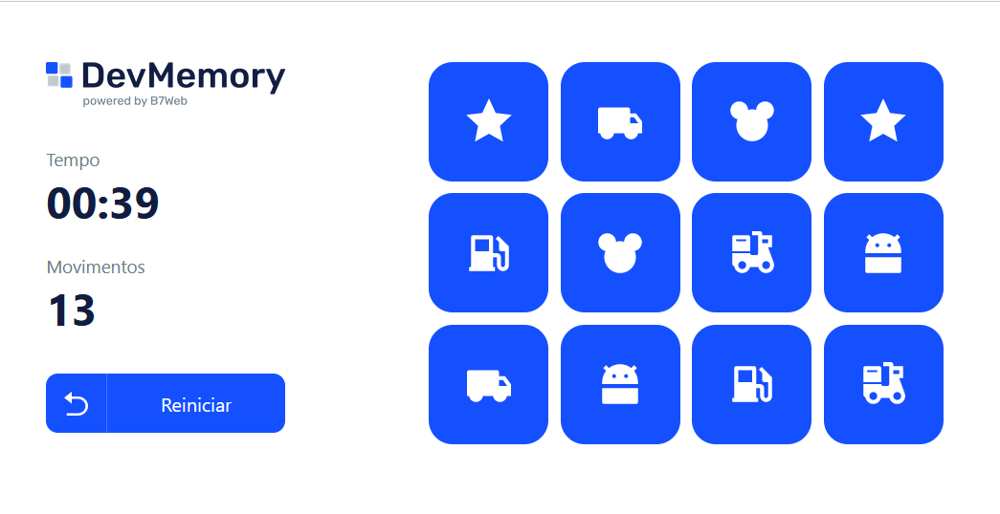
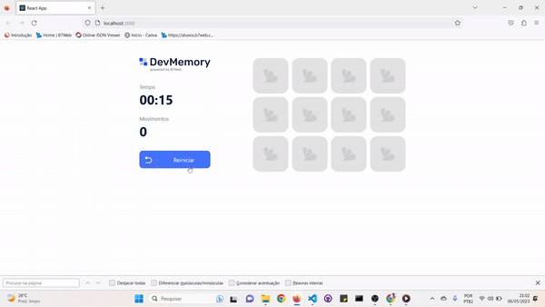

# Jogo da Memória
## Descrição
Projeto em React + Typescript, para estilização foi usado o Tailwind 
## Demostrção

 
 

## Instalação e execução do projeto
### `npm start`
### `npm run buld`

## Créditos
Desenvolvido por [Jeanderson Santos](https://github.com/JeandersonSantos) durante o curso [B7Web](https://b7web.com.br)

